<p align="center">
  
</p>

<h1 align="center">PANDAI</h1>

<p align="center">
  <b>Plant Identification with Artificial Intelligence</b><br>
  Aplikasi belajar tumbuhan bergamifikasi untuk siswa sekolah dasar, karya Tim Terang Bulan.<br>
  <i>A gamified plant-learning app for primary school students, by Team Terang Bulan.</i>
</p>

<p align="center">
  <a href="https://github.com/khaichi11/Mobile-APP-Plant-Detection-Mobilenet/actions/workflows/flutter.yml"></a>
  <a href="https://github.com/khaichi11/Mobile-APP-Plant-Detection-Mobilenet/actions/workflows/ml.yml"></a>
</p>

<p align="center">
  <a href="#bahasa-indonesia">Bahasa Indonesia</a> · <a href="#english">English</a>
</p>

<p align="center">
  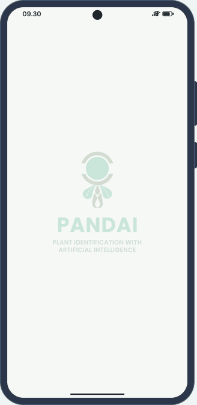
</p>

<p align="center">
  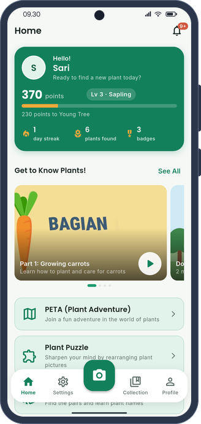
  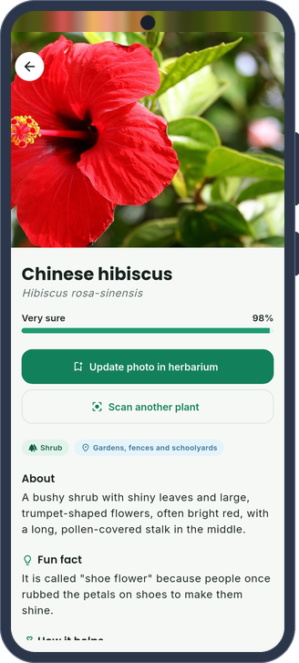
  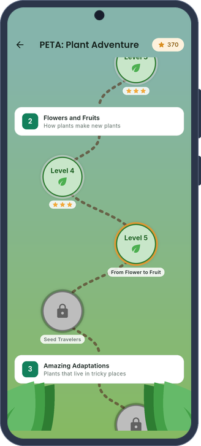
  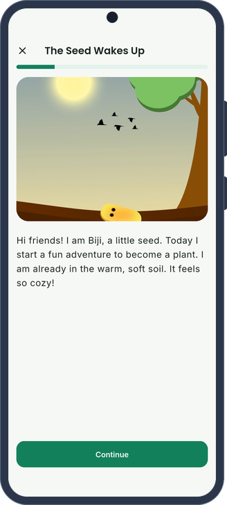
</p>

---

## Bahasa Indonesia

### Tentang Pandai

Literasi siswa sekolah dasar terhadap keanekaragaman tumbuhan masih tergolong rendah. Gejala ini dikenal sebagai
*plant blindness*: materi sains di sekolah lebih banyak membahas hewan, sementara anak-anak di perkotaan jarang
bersentuhan langsung dengan alam.

Pandai mengajak siswa mempelajari tumbuhan secara aktif di luar kelas melalui gamifikasi. Siswa memotret tumbuhan di
sekitar mereka, kecerdasan buatan di ponsel mengenalinya, dan hasilnya dikumpulkan dalam herbarium pribadi sambil
siswa menjalani petualangan, puzzle, dan kuis. Pandai mendukung SDG 4 tentang pendidikan berkualitas dan SDG 15 tentang
ekosistem daratan.

Saat dibuka, logo Pandai muncul perlahan di tengah layar, diam sejenak, lalu memudar dan aplikasi langsung tampil.
Pembukanya sengaja dibuat tenang agar anak dapat segera mulai bermain; ketuk layar untuk melewatinya.

### Tangkapan layar

<table>
  <tr>
    <td align="center" width="25%">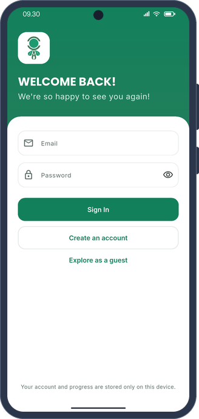<br><sub>Masuk</sub></td>
    <td align="center" width="25%"><br><sub>Beranda</sub></td>
    <td align="center" width="25%">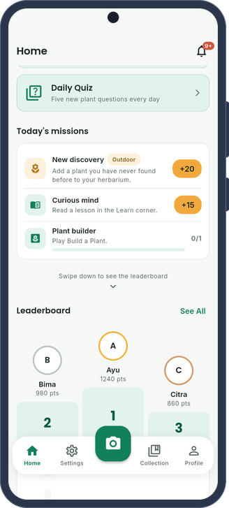<br><sub>Game dan misi</sub></td>
    <td align="center" width="25%">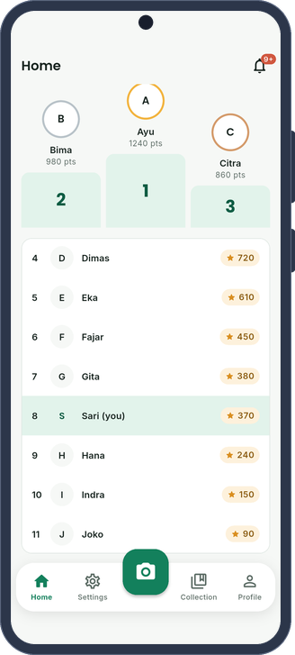<br><sub>Peringkat</sub></td>
  </tr>
  <tr>
    <td align="center" width="25%">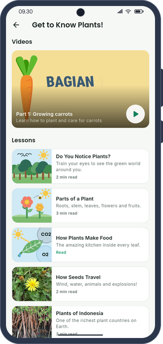<br><sub>Mengenal Tanaman</sub></td>
    <td align="center" width="25%"><br><sub>Hasil pindai AI</sub></td>
    <td align="center" width="25%">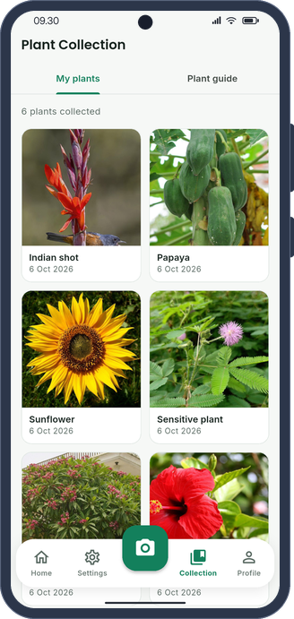<br><sub>Koleksi</sub></td>
    <td align="center" width="25%">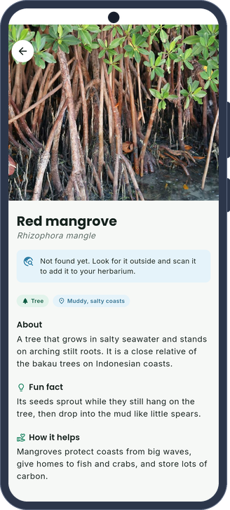<br><sub>Detail tumbuhan</sub></td>
  </tr>
  <tr>
    <td align="center" width="25%"><br><sub>Peta PETA</sub></td>
    <td align="center" width="25%"><br><sub>Cerita PETA</sub></td>
    <td align="center" width="25%">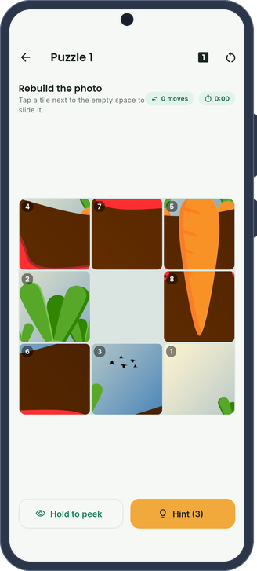<br><sub>Puzzle</sub></td>
    <td align="center" width="25%">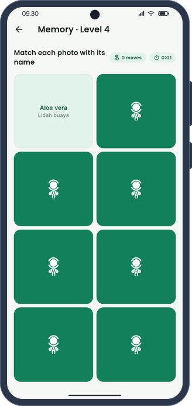<br><sub>Memory Match</sub></td>
  </tr>
  <tr>
    <td align="center" width="25%">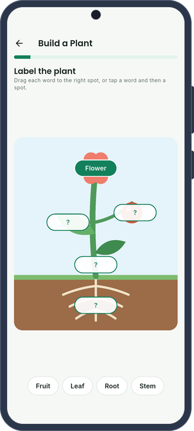<br><sub>Build a Plant</sub></td>
    <td align="center" width="25%">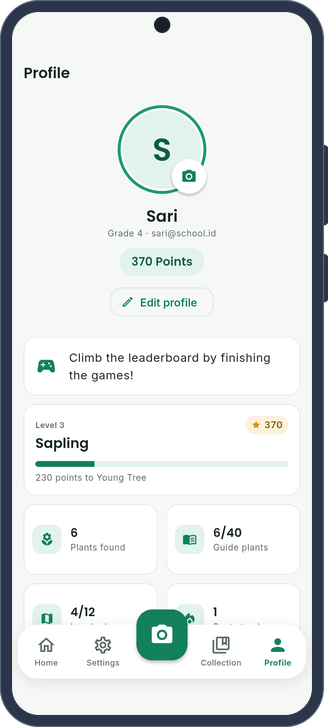<br><sub>Profil</sub></td>
    <td align="center" width="25%">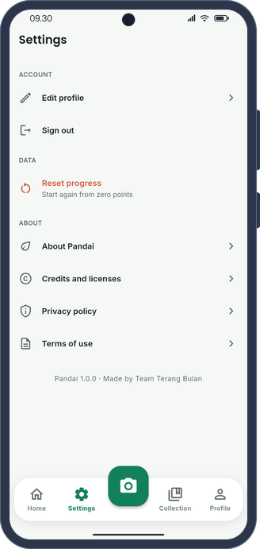<br><sub>Pengaturan</sub></td>
    <td width="25%"></td>
  </tr>
</table>

Seluruh tangkapan layar dibuat secara otomatis oleh integration test di emulator Android, termasuk hasil pindai yang
memakai model AI sebenarnya. Bingkai ponsel digambar sendiri dengan skrip `phone_frame.py` dari repo
[MEIRA](https://github.com/khaichi11/MEIRA) (Apache-2.0), tanpa memakai templat perangkat dari pihak lain.

### Fitur

Inti aplikasi adalah identifikasi tumbuhan dengan model klasifikasi gambar MobileNet yang berjalan langsung di ponsel
melalui TensorFlow Lite. Model ini mengenali 2.101 spesies dan tetap bekerja tanpa internet. Apabila hasilnya kurang
meyakinkan, aplikasi menandainya serta memberikan tips memotret dan beberapa tebakan alternatif. Hasil pindaian
tersimpan dalam koleksi tanaman pribadi milik siswa.

Pengetahuan siswa diperkaya oleh panduan 40 tumbuhan yang memuat foto asli, nama lokal, fakta menarik, manfaat, dan
peringatan keamanan untuk tumbuhan beracun atau menyebabkan gatal. Untuk tumbuhan di luar panduan, aplikasi
menampilkan ringkasan Wikipedia ketika perangkat terhubung ke internet. Halaman Mengenal Tanaman menyajikan video
belajar buatan tim dan materi singkat, termasuk penjelasan tentang *plant blindness* dan SDG 15.

Pembelajaran dikemas dalam beberapa permainan. PETA (Petualangan Tanaman) berisi empat bab dan dua belas level cerita
bergambar dan kuis dengan penilaian satu hingga tiga bintang. Puzzle Tanaman menyediakan dua belas puzzle geser dari
foto tumbuhan asli, lengkap dengan hitungan langkah, pengatur waktu, fitur intip gambar, dan tiga petunjuk harian yang
selalu benar. Memory Match terdiri atas enam level untuk mencocokkan foto dengan foto atau foto dengan nama, sedangkan
Build a Plant mengajak siswa menempelkan label bagian tumbuhan lalu mencocokkan fungsinya. Kuis harian menampilkan
pertanyaan "tumbuhan apakah ini?" berdasarkan foto.

Motivasi siswa dijaga melalui misi harian yang selalu menyertakan satu misi luar ruangan, poin, peringkat, streak
harian, dua belas lencana, notifikasi, dan papan peringkat kelas. Data akun dan kemajuan belajar disimpan di
perangkat, dan kata sandi disimpan dalam bentuk hash dengan salt.

### Teknologi

| Bagian | Teknologi |
| --- | --- |
| Aplikasi | Flutter 3.41, Dart, Provider, video_player, dan Chewie |
| AI di perangkat | TensorFlow Lite, MobileNet (Google AIY Plants V1, 2.101 spesies) |
| Penyimpanan | Basis data lokal di atas `shared_preferences`, foto di folder aplikasi |
| Pengembangan model | Python, PyTorch, torchvision, Weights & Biases, ekspor ke TFLite dengan AI Edge Torch |
| Pengujian dan CI | Unit, widget, dan integration test, GitHub Actions |

Pengembangan dilakukan secara agile dengan pendekatan *test-driven development*, sehingga logika permainan, skor,
misi, akun, dan pemrosesan gambar ditulis bersamaan dengan pengujiannya.

### Menjalankan aplikasi

Aplikasi memerlukan Flutter 3.41 dan Android SDK.

```bash
flutter pub get
flutter run
```

Untuk menghasilkan berkas rilis Google Play, jalankan perintah berikut.

```bash
flutter build appbundle --release
```

Build rilis memerlukan `android/key.properties` yang berisi `storeFile`, `storePassword`, `keyAlias`, dan
`keyPassword`. Berkas ini tidak pernah dimasukkan ke repositori; tanpa berkas tersebut, build rilis memakai kunci
debug.

### Pengujian

```bash
flutter test
flutter drive --driver=test_driver/integration_test.dart \
  --target=integration_test/app_test.dart
```

`flutter test` menjalankan uji unit dan widget, sedangkan integration test berjalan di emulator atau ponsel. Uji
integrasi tersebut menjalankan model asli pada 40 foto panduan dan menghasilkan seluruh tangkapan layar di
`docs/screenshots/`. Pada pengujian terakhir, tebakan pertama model benar untuk 27 dari 40 foto, dan jawaban yang benar
masuk lima besar untuk 38 dari 40 foto.

GIF demo di bagian atas dirender di laptop tanpa emulator: `test/demo_render_test.dart` menggambar setiap layar dan
menyimpan bingkainya, lalu `tool/render_gif.py` menyusunnya ke dalam bingkai ponsel lengkap dengan bilah status.

```bash
DEMO_FRAMES=build/frames flutter test test/demo_render_test.dart
python3 tool/render_gif.py build/frames docs/demo.gif
```

### Melatih model sendiri

Folder [`ml/`](ml) berisi pipeline PyTorch untuk melatih MobileNetV3 dengan dataset tumbuhan lokal yang disusun dalam
satu folder untuk setiap spesies.

```bash
cd ml
pip install -r requirements.txt -r requirements-export.txt
python -m pandai_ml.train --data-dir data --epochs 15 --wandb
python -m pandai_ml.export --checkpoint runs/latest/best.pt --output runs/latest
```

Hasilnya, `plant_classifier.tflite` dan `plant_labels.csv`, disalin ke `assets/models/`. Aplikasi mendukung model float
maupun model terkuantisasi. Workflow GitHub Actions `Plant model` menguji kode ini pada setiap perubahan dan dapat
dijalankan secara manual untuk melatih model dengan pencatatan ke Weights & Biases melalui secret `WANDB_API_KEY`.

### Rencana berikutnya

- Sinkronisasi akun dan peringkat kelas secara daring melalui Firebase Authentication dan Supabase. Fitur ini sengaja
  belum dipasang agar repositori publik ini tidak menyimpan kunci API.
- Dataset dan model yang dikhususkan untuk tumbuhan Indonesia.
- Dasbor guru untuk memantau kemajuan kelas.

### Kredit

- Logo Pandai, ilustrasi Biji si benih, gambar wortel, dan video belajar dibuat oleh Tim Terang Bulan.
- Model identifikasi adalah Google AIY Vision Classifier Plants V1 (Apache 2.0).
- Foto tumbuhan berasal dari Wikimedia Commons dengan lisensi CC BY, CC BY-SA, dan domain publik; daftar lengkapnya
  tercantum di [`assets/images/plants/CREDITS.md`](assets/images/plants/CREDITS.md).
- Huruf Poppins dan Inter memakai SIL Open Font License.

---

## English

### About Pandai

Primary school students often know surprisingly little about the plants around them. This is known as *plant
blindness*: school science tends to focus on animals rather than plants, and children in cities rarely spend time in
nature.

Pandai encourages students to learn about plants actively outside the classroom through play. Students photograph
the plants around them, on-device AI identifies each one, and the results are gathered in a personal herbarium while
students work through an adventure, puzzles, and quizzes. Pandai supports SDG 4 on quality education and SDG 15 on
life on land.

On launch the Pandai logo fades in at the centre of the screen, rests for a moment, and then fades out straight into
the app. The opening is kept calm so children can start playing right away; tapping the screen skips it.

### Screenshots

<table>
  <tr>
    <td align="center" width="25%"><br><sub>Sign in</sub></td>
    <td align="center" width="25%"><br><sub>Games and missions</sub></td>
    <td align="center" width="25%"><br><sub>Collection</sub></td>
    <td align="center" width="25%"><br><sub>Plant details</sub></td>
  </tr>
  <tr>
    <td align="center" width="25%"><br><sub>Puzzle</sub></td>
    <td align="center" width="25%"><br><sub>Memory Match</sub></td>
    <td align="center" width="25%"><br><sub>Build a Plant</sub></td>
    <td align="center" width="25%"><br><sub>Profile</sub></td>
  </tr>
</table>

Every screenshot is captured automatically by the integration test on an Android emulator, including the scan result
from the real AI model. The phone frames are drawn with the `phone_frame.py` script from the
[MEIRA](https://github.com/khaichi11/MEIRA) repository (Apache-2.0); no third-party device mockups are used.

### Features

At the heart of the app is plant identification with a MobileNet image classifier that runs directly on the phone
through TensorFlow Lite. The model recognises 2,101 species and keeps working offline. When a result is uncertain,
the app flags it and offers photo tips together with alternative guesses. Every scan is saved in the student's own
plant collection.

Students can learn more from a guide of 40 plants with real photos, Indonesian names, fun facts, uses, and safety
warnings for poisonous or stinging plants. For plants outside the guide, the app shows a Wikipedia summary when the
device is online. The Get to Know Plants page offers a learning video made by the team and short lessons, including
an explanation of plant blindness and SDG 15.

Learning is wrapped in several games. PETA (Plant Adventure) has four chapters and twelve levels of illustrated
stories and questions, each rated from one to three stars. Plant Puzzle offers twelve sliding puzzles made from real
plant photos, with a move counter, a timer, a peek option, and three daily hints that are always correct. Memory Match
has six levels that pair photo with photo or photo with name, while Build a Plant asks students to label the parts of
a plant and then match them with their functions. A daily quiz asks "which plant is this?" based on a photo.

Motivation is kept up through daily missions that always include an outdoor task, along with points, ranks, daily
streaks, twelve badges, notifications, and a class ranking. Account data and learning progress are stored on the
device, and passwords are kept as salted hashes.

### Tech stack

| Part | Technology |
| --- | --- |
| App | Flutter 3.41, Dart, Provider, video_player, and Chewie |
| On-device AI | TensorFlow Lite, MobileNet (Google AIY Plants V1, 2,101 species) |
| Storage | Local database on top of `shared_preferences`, photos in the app folder |
| Model development | Python, PyTorch, torchvision, Weights & Biases, TFLite export with AI Edge Torch |
| Testing and CI | Unit, widget, and integration tests, GitHub Actions |

Development follows an agile, test-driven approach, so the game logic, scoring, missions, accounts, and image
processing are written together with their tests.

### Running the app

The app requires Flutter 3.41 and the Android SDK.

```bash
flutter pub get
flutter run
```

To produce a Google Play release, run the following command.

```bash
flutter build appbundle --release
```

A release build needs `android/key.properties` with `storeFile`, `storePassword`, `keyAlias`, and `keyPassword`. This
file is never committed; without it, release builds use the debug key.

### Testing

```bash
flutter test
flutter drive --driver=test_driver/integration_test.dart \
  --target=integration_test/app_test.dart
```

`flutter test` runs the unit and widget tests, while the integration test runs on an emulator or a phone. The
integration test runs the real model on the 40 guide photos and produces every screenshot in `docs/screenshots/`. In
the latest run, the model's first guess was correct for 27 of the 40 photos, and the right answer was in the top five
for 38 of them.

The demo GIF at the top is rendered on a laptop without an emulator: `test/demo_render_test.dart` draws every screen
and saves the frames, and `tool/render_gif.py` then places them in a phone frame with a status bar.

```bash
DEMO_FRAMES=build/frames flutter test test/demo_render_test.dart
python3 tool/render_gif.py build/frames docs/demo.gif
```

### Training your own model

The [`ml/`](ml) folder contains a PyTorch pipeline that fine-tunes MobileNetV3 on a plant dataset arranged as one
folder per species.

```bash
cd ml
pip install -r requirements.txt -r requirements-export.txt
python -m pandai_ml.train --data-dir data --epochs 15 --wandb
python -m pandai_ml.export --checkpoint runs/latest/best.pt --output runs/latest
```

The resulting `plant_classifier.tflite` and `plant_labels.csv` are copied into `assets/models/`. The app supports both
float and quantized models. The `Plant model` GitHub Actions workflow tests this code on every change and can be
started manually to train a model with Weights & Biases logging through the `WANDB_API_KEY` secret.

### Project structure

```
lib/
  core/        theme and formatting
  data/        plant guide, stories, levels, lessons, missions, and badges
  games/       puzzle, memory, and quiz logic without Flutter code
  models/      data classes
  services/    local database, accounts, classifier, photos, and Wikipedia
  state/       app state and scoring rules
  ui/          screens and widgets
ml/            PyTorch training and export
tool/          scripts for photos, logo tracing, and app icons
```

### Roadmap

- Online accounts and class rankings with Firebase Authentication and Supabase. These are left out on purpose for now
  so that this public repository holds no API keys.
- A dataset and model focused on Indonesian plants.
- A teacher dashboard for following class progress.

### Credits

- The Pandai logo, the Biji the seed illustrations, the carrot artwork, and the learning video were made by Team
  Terang Bulan.
- The identification model is Google AIY Vision Classifier Plants V1 (Apache 2.0).
- The plant photos come from Wikimedia Commons under CC BY, CC BY-SA, and public domain licenses; the full list is in
  [`assets/images/plants/CREDITS.md`](assets/images/plants/CREDITS.md).
- The Poppins and Inter fonts use the SIL Open Font License.
