<p align="center">
  
</p>

<h1 align="center">PANDAI</h1>

<p align="center">
  <b>Plant Identification with Artificial Intelligence</b><br>
  A gamified plant-learning app for elementary school students, by Team Terang Bulan.
</p>

<p align="center">
  <a href="https://github.com/khaichi11/Mobile-APP-Plant-Detection-Mobilenet/actions/workflows/flutter.yml"></a>
  <a href="https://github.com/khaichi11/Mobile-APP-Plant-Detection-Mobilenet/actions/workflows/ml.yml"></a>
</p>

<p align="center">
  <a href="#bahasa-indonesia">Bahasa Indonesia</a> · <a href="#english">English</a>
</p>

<p align="center">
  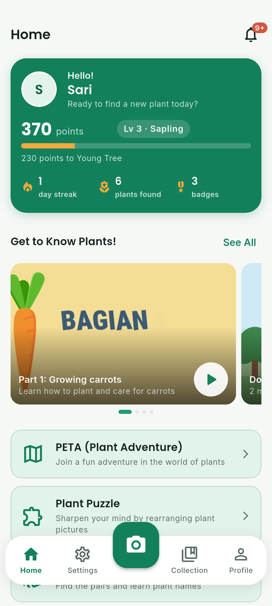
  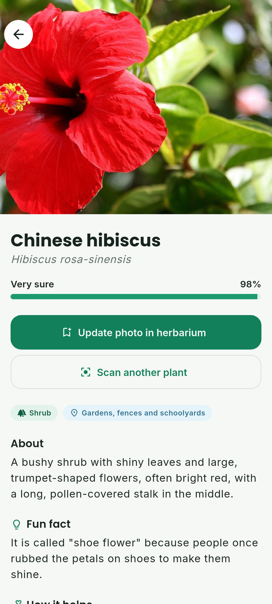
  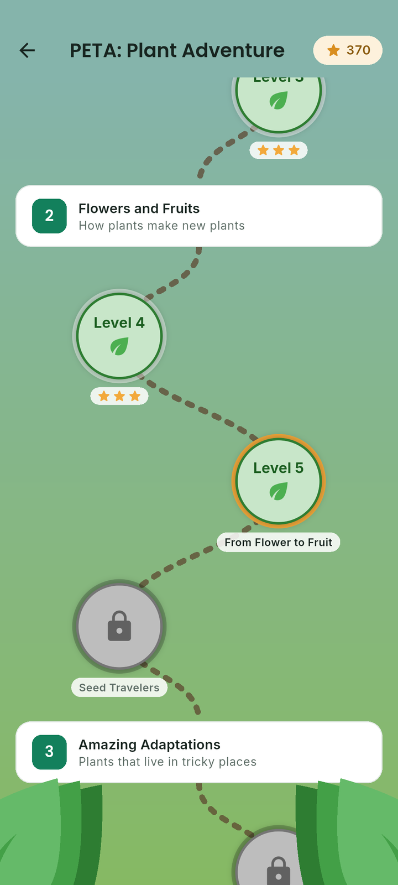
  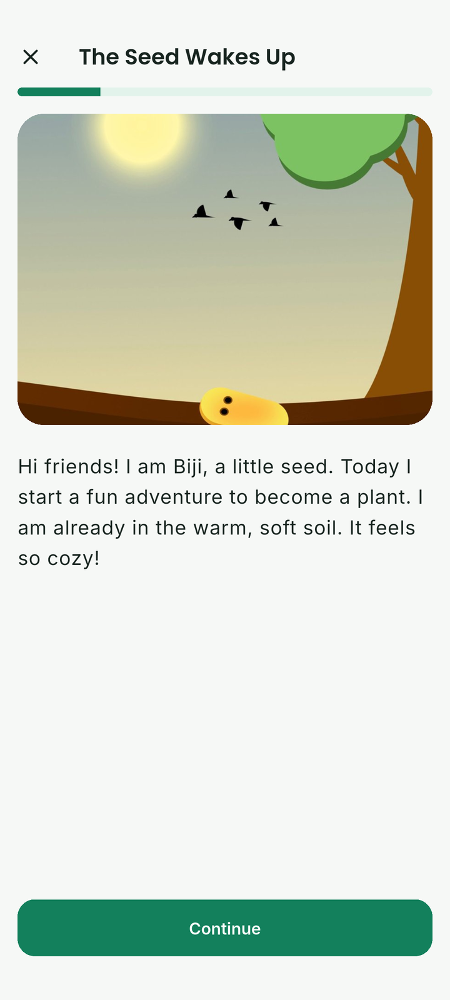
</p>

---

## Bahasa Indonesia

### Tentang Pandai

Literasi siswa sekolah dasar terhadap keanekaragaman tumbuhan masih rendah.
Fenomena ini dikenal sebagai *plant blindness*: konten sains di sekolah lebih
banyak membahas hewan, dan anak-anak di perkotaan jarang bersentuhan dengan
alam.

Pandai mengajak siswa belajar tumbuhan secara aktif di luar kelas lewat
gamifikasi. Siswa memotret tumbuhan di sekitar mereka, AI di ponsel
mengenalinya, lalu mereka mengumpulkannya di herbarium sambil bermain
petualangan, puzzle, dan kuis. Pandai mendukung SDG 4 (Pendidikan
Berkualitas) dan SDG 15 (Ekosistem Daratan).

### Tangkapan layar

<table>
  <tr>
    <td align="center" width="25%">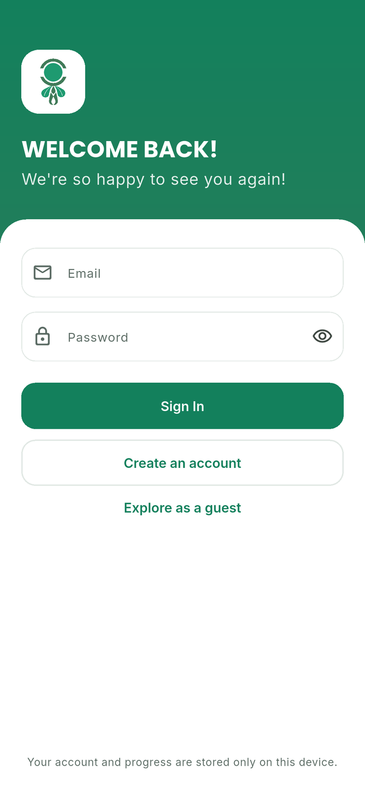<br><sub>Masuk</sub></td>
    <td align="center" width="25%"><br><sub>Beranda</sub></td>
    <td align="center" width="25%">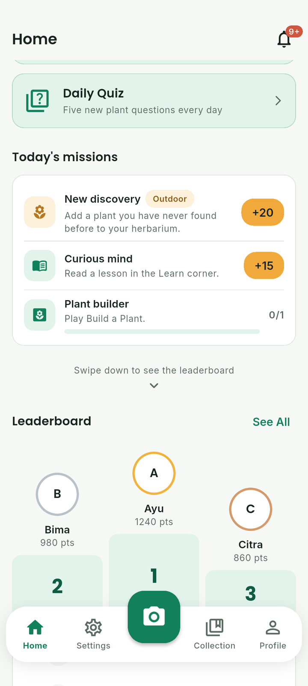<br><sub>Game dan misi</sub></td>
    <td align="center" width="25%">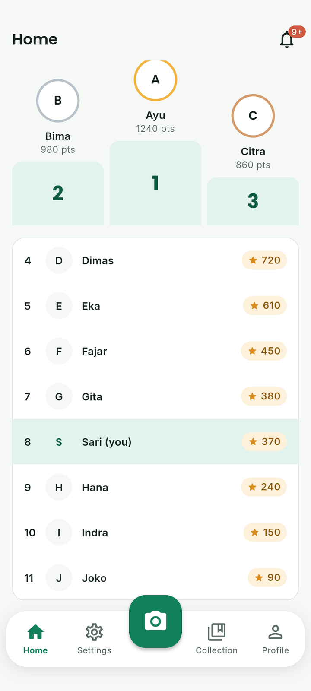<br><sub>Peringkat</sub></td>
  </tr>
  <tr>
    <td align="center" width="25%">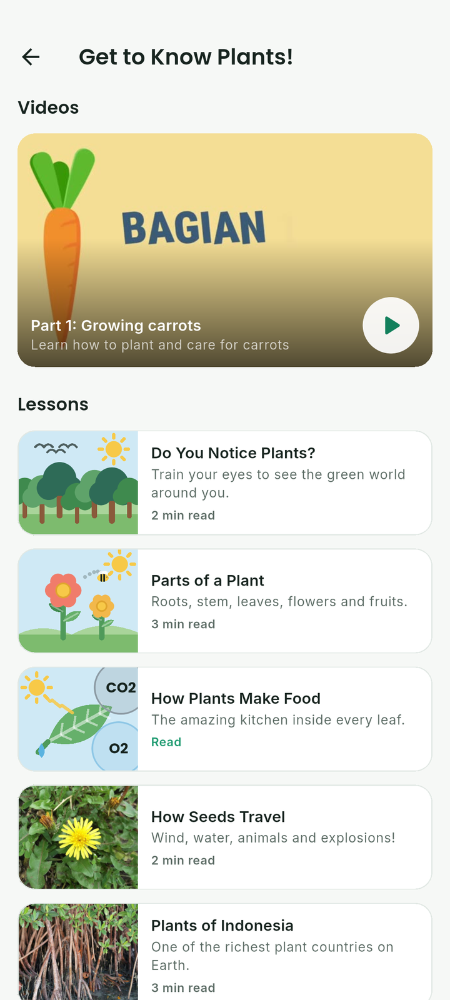<br><sub>Mengenal Tanaman</sub></td>
    <td align="center" width="25%"><br><sub>Hasil pindai AI</sub></td>
    <td align="center" width="25%">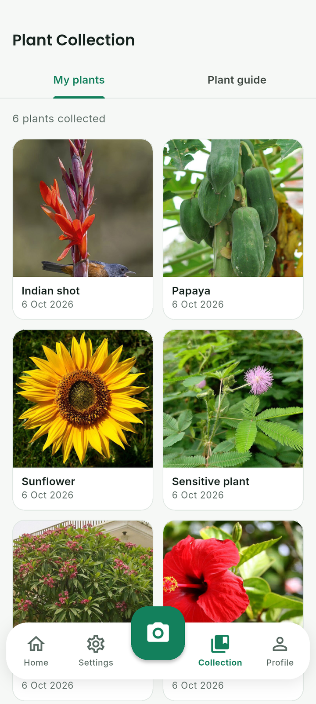<br><sub>Koleksi</sub></td>
    <td align="center" width="25%">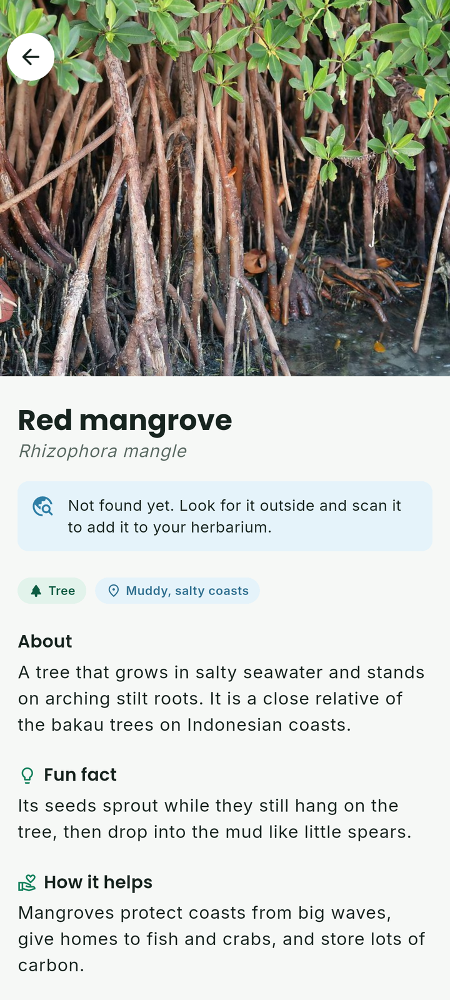<br><sub>Detail tumbuhan</sub></td>
  </tr>
  <tr>
    <td align="center" width="25%"><br><sub>Peta PETA</sub></td>
    <td align="center" width="25%"><br><sub>Cerita PETA</sub></td>
    <td align="center" width="25%">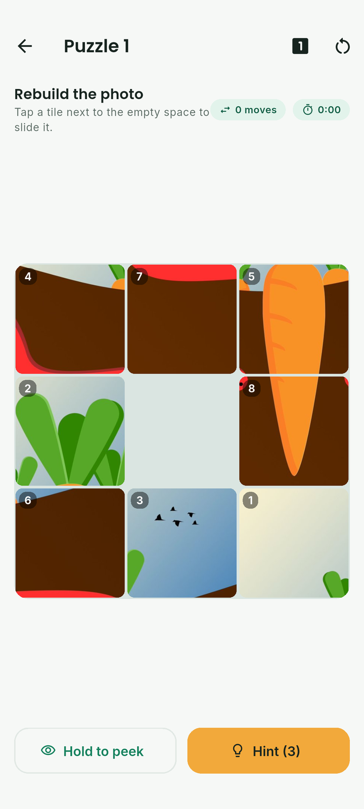<br><sub>Puzzle</sub></td>
    <td align="center" width="25%">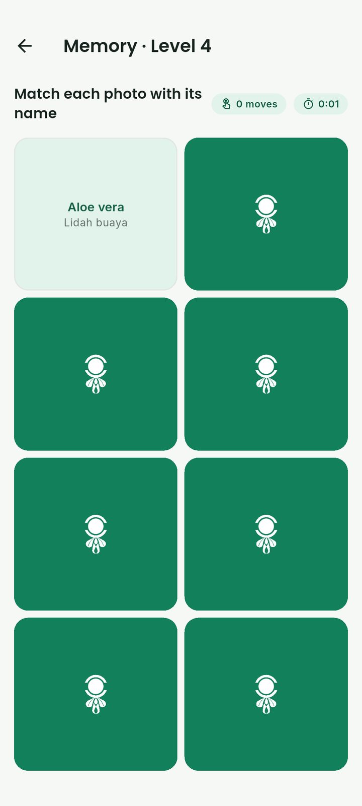<br><sub>Memory Match</sub></td>
  </tr>
  <tr>
    <td align="center" width="25%">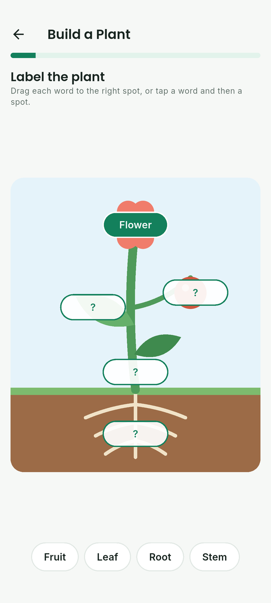<br><sub>Build a Plant</sub></td>
    <td align="center" width="25%">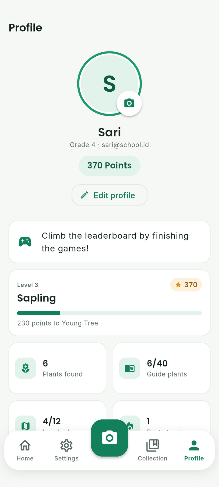<br><sub>Profil</sub></td>
    <td align="center" width="25%">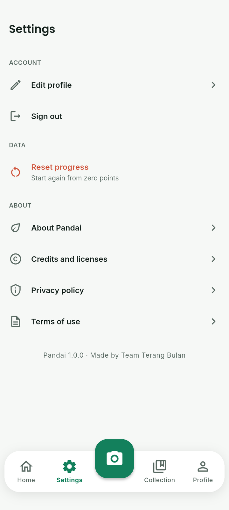<br><sub>Pengaturan</sub></td>
  </tr>
</table>

Semua tangkapan layar dibuat otomatis oleh integration test di emulator
Android, termasuk hasil pindai yang memakai model AI asli.

### Fitur

- **Identifikasi tumbuhan dengan AI.** Model klasifikasi gambar MobileNet
  berjalan langsung di ponsel (TensorFlow Lite), mengenali 2.101 spesies, dan
  tetap bekerja tanpa internet. Hasil yang kurang yakin ditandai beserta tips
  memotret dan tebakan alternatif.
- **Panduan 40 tumbuhan** dengan foto asli, nama lokal, fakta menarik,
  manfaat, dan peringatan keamanan untuk tumbuhan beracun atau gatal.
  Tumbuhan di luar panduan menampilkan ringkasan Wikipedia saat online.
- **Koleksi tanaman** pribadi berisi foto hasil pindaian siswa.
- **PETA (Petualangan Tanaman):** peta petualangan 4 bab dan 12 level berisi
  cerita bergambar dan kuis, dengan bintang 1 sampai 3.
- **Puzzle Tanaman:** 12 puzzle geser dari foto tumbuhan asli, dengan hitungan
  langkah, waktu, intip gambar, dan 3 petunjuk per hari yang selalu benar.
- **Memory Match:** 6 level mencocokkan foto dengan foto atau dengan nama.
- **Build a Plant:** tempel label bagian tumbuhan lalu cocokkan fungsinya.
- **Kuis harian** dengan pertanyaan "tumbuhan apakah ini?" dari foto.
- **Misi harian** yang selalu menyertakan satu misi luar ruangan, poin,
  peringkat, streak harian, 12 lencana, notifikasi, dan papan peringkat kelas.
- **Mengenal Tanaman:** video belajar buatan tim dan materi singkat, termasuk
  tentang *plant blindness* dan SDG 15.
- Data akun dan progres tersimpan di perangkat. Kata sandi disimpan sebagai
  hash dengan salt.

### Teknologi

| Bagian | Teknologi |
| --- | --- |
| Aplikasi | Flutter 3.41, Dart, Provider, video_player dan Chewie |
| AI di perangkat | TensorFlow Lite, MobileNet (Google AIY Plants V1, 2.101 spesies) |
| Penyimpanan | Basis data lokal di atas `shared_preferences`, foto di folder aplikasi |
| Pengembangan model | Python, PyTorch, torchvision, Weights & Biases, ekspor ke TFLite dengan AI Edge Torch |
| Pengujian dan CI | Unit, widget, dan integration test, GitHub Actions |

Pengembangan dilakukan secara agile dengan *test-driven development*: logika
permainan, skor, misi, akun, dan pemrosesan gambar ditulis bersama
pengujiannya.

### Menjalankan aplikasi

Butuh Flutter 3.41 dan Android SDK.

```bash
flutter pub get
flutter run
```

Build untuk Google Play:

```bash
flutter build appbundle --release
```

Untuk rilis, buat `android/key.properties` (berisi `storeFile`,
`storePassword`, `keyAlias`, `keyPassword`). File ini tidak pernah di-commit.
Tanpa file ini build rilis memakai kunci debug.

### Pengujian

```bash
flutter test                      # unit dan widget test
flutter drive --driver=test_driver/integration_test.dart \
  --target=integration_test/app_test.dart   # di emulator atau HP
```

Integration test menjalankan model asli pada 40 foto panduan dan membuat
semua tangkapan layar di `docs/screenshots/`. Hasil terakhir: benar di tebakan
pertama 27 dari 40, dan masuk 5 besar 38 dari 40.

### Melatih model sendiri

Folder [`ml/`](ml) berisi pipeline PyTorch untuk melatih MobileNetV3 dengan
dataset tumbuhan lokal (satu folder per spesies):

```bash
cd ml
pip install -r requirements.txt -r requirements-export.txt
python -m pandai_ml.train --data-dir data --epochs 15 --wandb
python -m pandai_ml.export --checkpoint runs/latest/best.pt --output runs/latest
```

Salin `plant_classifier.tflite` dan `plant_labels.csv` ke `assets/models/`.
Aplikasi otomatis mendukung model float maupun terkuantisasi. Workflow
GitHub Actions `Plant model` menguji kode ini di setiap perubahan, dan bisa
dijalankan manual untuk melatih model dengan log ke Weights & Biases (set
secret `WANDB_API_KEY`).

### Rencana berikutnya

- Sinkronisasi akun dan peringkat kelas secara online (Firebase Authentication
  dan Supabase). Saat ini sengaja belum dipakai supaya repositori publik ini
  tidak menyimpan kunci API.
- Dataset dan model khusus tumbuhan Indonesia.
- Dasbor guru untuk memantau progres kelas.

### Kredit

- Logo Pandai, ilustrasi Biji si benih, gambar wortel, dan video belajar:
  Tim Terang Bulan.
- Model identifikasi: Google AIY Vision Classifier Plants V1 (Apache 2.0).
- Foto tumbuhan: Wikimedia Commons, lisensi CC BY, CC BY-SA, dan domain
  publik. Daftar lengkap di
  [`assets/images/plants/CREDITS.md`](assets/images/plants/CREDITS.md).
- Font: Poppins dan Inter (SIL Open Font License).

---

## English

### About Pandai

Elementary school students know surprisingly little about the plants around
them. This is called *plant blindness*: school science focuses more on
animals than plants, and city children spend little time in nature.

Pandai gets students learning about plants outdoors through play. They
photograph plants around them, on-device AI identifies them, and they collect
them in a herbarium while playing an adventure, puzzles and quizzes. Pandai
supports SDG 4 (Quality Education) and SDG 15 (Life on Land).

### Screenshots

<table>
  <tr>
    <td align="center" width="25%"><br><sub>Sign in</sub></td>
    <td align="center" width="25%"><br><sub>Home</sub></td>
    <td align="center" width="25%"><br><sub>Games and missions</sub></td>
    <td align="center" width="25%"><br><sub>Leaderboard</sub></td>
  </tr>
  <tr>
    <td align="center" width="25%"><br><sub>Get to Know Plants</sub></td>
    <td align="center" width="25%"><br><sub>AI scan result</sub></td>
    <td align="center" width="25%"><br><sub>Collection</sub></td>
    <td align="center" width="25%"><br><sub>Plant details</sub></td>
  </tr>
  <tr>
    <td align="center" width="25%"><br><sub>PETA map</sub></td>
    <td align="center" width="25%"><br><sub>PETA story</sub></td>
    <td align="center" width="25%"><br><sub>Puzzle</sub></td>
    <td align="center" width="25%"><br><sub>Memory Match</sub></td>
  </tr>
  <tr>
    <td align="center" width="25%"><br><sub>Build a Plant</sub></td>
    <td align="center" width="25%"><br><sub>Profile</sub></td>
    <td align="center" width="25%"><br><sub>Settings</sub></td>
  </tr>
</table>

Every screenshot is taken automatically by the integration test on an Android
emulator, including the scan result from the real AI model.

### Features

- **AI plant identification.** A MobileNet image classifier runs on the phone
  with TensorFlow Lite, recognises 2,101 species and works offline. Unsure
  results are flagged with photo tips and alternative guesses.
- **A guide of 40 plants** with real photos, Indonesian names, fun facts,
  uses and safety warnings for poisonous or stinging plants. Plants outside
  the guide show a Wikipedia summary when online.
- **A personal plant collection** of the student's own scans.
- **PETA (Plant Adventure):** an adventure map with 4 chapters and 12 levels
  of illustrated stories and questions, rated with 1 to 3 stars.
- **Plant Puzzle:** 12 sliding puzzles made from real plant photos, with a
  move counter, timer, peek, and 3 always-correct hints a day.
- **Memory Match:** 6 levels matching photo to photo or photo to name.
- **Build a Plant:** label the parts of a plant, then match what they do.
- **Daily quiz** with "which plant is this?" photo questions.
- **Daily missions** that always include an outdoor mission, plus points,
  ranks, daily streaks, 12 badges, notifications and a class ranking.
- **Get to Know Plants:** a learning video made by the team and short
  lessons, including plant blindness and SDG 15.
- Accounts and progress are stored on the device. Passwords are salted and
  hashed.

### Tech stack

| Part | Technology |
| --- | --- |
| App | Flutter 3.41, Dart, Provider, video_player and Chewie |
| On-device AI | TensorFlow Lite, MobileNet (Google AIY Plants V1, 2,101 species) |
| Storage | Local database on top of `shared_preferences`, photos in the app folder |
| Model development | Python, PyTorch, torchvision, Weights & Biases, TFLite export with AI Edge Torch |
| Testing and CI | Unit, widget and integration tests, GitHub Actions |

Development follows an agile, test-driven approach: game logic, scoring,
missions, accounts and image processing are written together with their
tests.

### Running the app

Requires Flutter 3.41 and the Android SDK.

```bash
flutter pub get
flutter run
```

Build for Google Play:

```bash
flutter build appbundle --release
```

For releases, create `android/key.properties` with `storeFile`,
`storePassword`, `keyAlias` and `keyPassword`. It is never committed. Without
it, release builds use the debug key.

### Testing

```bash
flutter test                      # unit and widget tests
flutter drive --driver=test_driver/integration_test.dart \
  --target=integration_test/app_test.dart   # on an emulator or phone
```

The integration test runs the real model on the 40 guide photos and creates
every screenshot in `docs/screenshots/`. Latest result: correct first guess
for 27 of 40, and in the top 5 for 38 of 40.

### Training your own model

The [`ml/`](ml) folder holds a PyTorch pipeline that fine-tunes MobileNetV3 on
a plant dataset (one folder per species):

```bash
cd ml
pip install -r requirements.txt -r requirements-export.txt
python -m pandai_ml.train --data-dir data --epochs 15 --wandb
python -m pandai_ml.export --checkpoint runs/latest/best.pt --output runs/latest
```

Copy `plant_classifier.tflite` and `plant_labels.csv` into `assets/models/`.
The app handles both float and quantized models. The `Plant model` GitHub
Actions workflow tests this code on every change and can be started by hand
to train a model with Weights & Biases logging (set the `WANDB_API_KEY`
secret).

### Project structure

```
lib/
  core/        theme, formatting
  data/        plant guide, stories, levels, lessons, missions, badges
  games/       puzzle, memory and quiz logic (no Flutter code)
  models/      data classes
  services/    local database, accounts, classifier, photos, Wikipedia
  state/       app state, scoring rules
  ui/          screens and widgets
ml/            PyTorch training and export
tool/          scripts for photos, logo tracing and app icons
```

### Roadmap

- Online accounts and class ranking (Firebase Authentication and Supabase).
  Left out on purpose for now so this public repository holds no API keys.
- A dataset and model focused on Indonesian plants.
- A teacher dashboard for class progress.

### Credits

- Pandai logo, the Biji the seed illustrations, the carrot artwork and the
  learning video: Team Terang Bulan.
- Identification model: Google AIY Vision Classifier Plants V1 (Apache 2.0).
- Plant photos: Wikimedia Commons under CC BY, CC BY-SA and public domain
  licenses. Full list in
  [`assets/images/plants/CREDITS.md`](assets/images/plants/CREDITS.md).
- Fonts: Poppins and Inter (SIL Open Font License).
